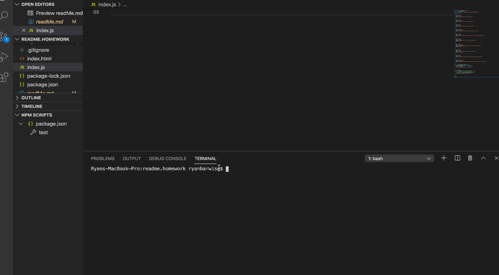

  
  # README-generator
  
  
   

  ## Description
 Command line-application that dynamically generates a README.md from a user's input

  ## Table of Contents
  1. [License](#license)
  2. [Installing Dependencies](#dependencies)
  3. [Tests](#tests)
  3. [Repo](#repo)
  4. [Contributions](#contributions)
  5. [Contact](#contact)

  
  ## License Information
     MIT

  
  ## Dependencies
     npm i

  
  ## Tests
   $ npm test

  
  ## Repo
  view, clone or fork at your pleasure...I welcome feedback

  
  ## Contributions 
   send me an email

  
  ## Contact
  <ryanbarwise@gmail.com>

  
  

  
    
  
  